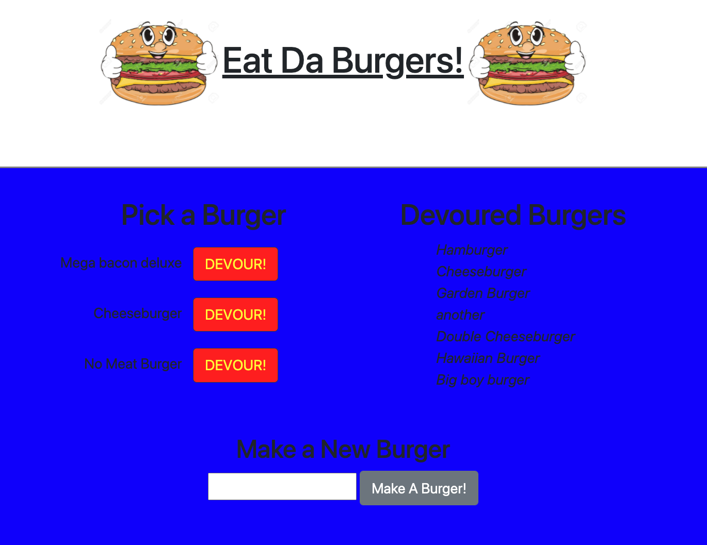

# Eat-Da-Burger

  
  

---

## Table of Contents
- [About the Project](#About-the-Project)
- [Getting Started](#Getting-Started)
- [Installation](#Installation)
- [Contributing](#Contributing)
- [Testing](#Testing)
- [License](#License) 

## About the Project
Eat-Da-Burger is a fun app that lets users input the names of burgers they'd like to eat. Whenever a user submits a burger's name, the app will display the burger on the left side of the page.  Each burger in the Pick a Burger area also has a `Devour!` button, when the user clicks it, the burger will move to the right side of the page.

## Getting Started  
To get started, visit the app at:

https://fathomless-retreat-85881.herokuapp.com/
  
  

### Installation  
To run this app localy, clone my repo at:
https://github.com/samrod777/Burger  

Then run the following command in your terminal to install required dependencies:  

npm install

## Testing
No testing required.
  

## Contributing
To contribute to this project contact Sam Rodriguez.  
Github Repository URL: https://github.com/samrod777/Burger   

## License
This application is covered under the MIT license.  

